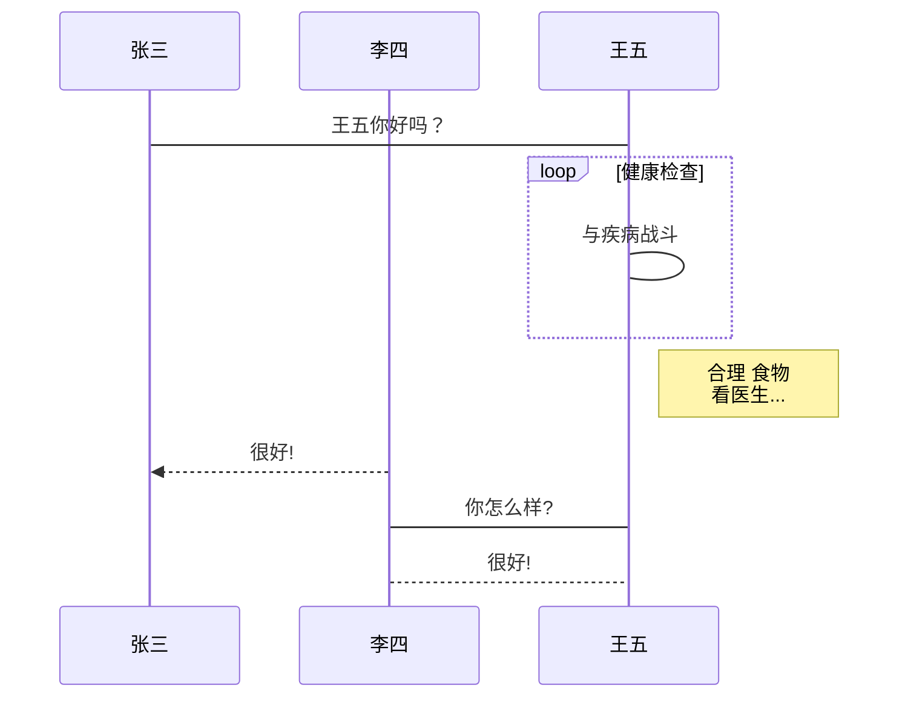
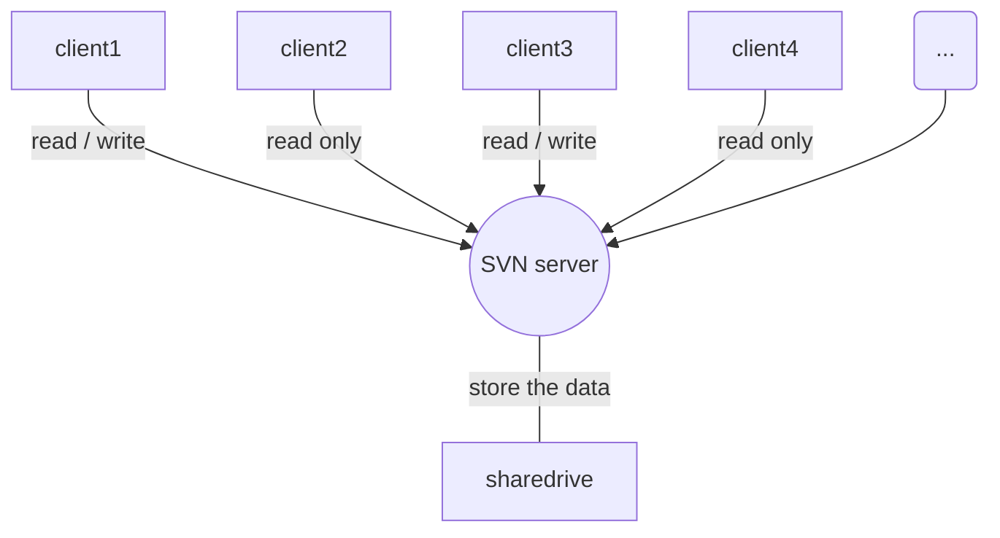

# 引言

一般论文写作等会有如下痛点，包含：
- 数学公式
- 图片处理
- 交叉引用、脚注、尾注
- 参考文献的文献库处理

当然大名鼎鼎的Microsoft Office当然能处理这些问题，但是与其说是能处理，不如说是处理的不当就会变得麻烦起来。在这些方面处理的最好的应该是LaTeX，但是由于其语法学习曲线非常陡峭，那么支持部分LaTeX特性的Markdown将是比较好的选择，处理得当时将包含如下特性：
- 基于自然语言的数学公式处理
- HTML支持，意味着markdown的写作可以很灵活多变
- 插件扩展的的流程图、甘特图、美人鱼图支持
- 交叉引用、脚注、尾注、文献自动插入
- 目录自动生成

那么本文将简要的介绍下如何使用markdown来进行基本的写作。

注：本文内容相对较多，但是请相信看完之后收获会是巨大的。


# 相关概念

## Markdown

> Markdown是一种可以使用普通文本编辑器编写的标记语言，通过简单的标记语法，它可以使普通文本内容具有一定的格式。
> Markdown具有一系列衍生版本，用于扩展Markdown的功能（如表格、脚注、内嵌HTML等等），这些功能原初的Markdown尚不具备，它们能让Markdown转换成更多的格式，例如LaTeX，Docbook。Markdown增强版中比较有名的有Markdown Extra、MultiMarkdown、 Maruku等。这些衍生版本要么基于工具，如Pandoc；要么基于网站，如GitHub和Wikipedia，在语法上基本兼容，但在一些语法和渲染效果上有改动。[^2][@noauthor_markdown__nodate]

看到这里很懵是不是？但是如果换种说法：DOC格式和markdown本是同根生，是不是就容易多了？DOC所有关键信息等均使用XML格式，而这个格式和markdown其实本质类似。区别是：

（图片）

哪个易读性更好一看便知。用markdown你能做什么？

- 记笔记
- 写网页
- 其他

### markdown编辑器推荐

#### Typora（全平台）

所见即所得，只有用过的才知道多好用。功能最全。但是不能进行扩展。其实已有的功能已经非常够用了。

#### Mu（Mac OS）

同样所见即所得，但是功能性比Typora弱。

#### Atom 或者 Visual Studio Code（全平台）

伪装成IDE的文本编辑器，一般程序员以及编程爱好者无人不知，有巨量的插件扩展。能玩游戏看B站听歌聊QQ微信微博。摸鱼神器。

## pandoc

> Pandoc是由John MacFarlane开发的标记语言转换工具，可实现不同标记语言间的格式转换，堪称该领域中的“瑞士军刀”。Pandoc使用Haskell语言编写，以命令行形式实现与用户的交互，可支持多种操作系统。[^3][@noauthor_pandoc_2017]

那么它能处理的格式到底有多少种：

（图片）

图片上一个节点代表它能处理的一种格式。

## 富文本

> 富文本格式（Rich Text Format, 一般简称为RTF）是由微软公司开发的跨平台文档格式。一般的格式设置，比如字体和段落设置，页面设置等等信息都可以存在RTF格式中。[^1][@noauthor___nodate]

这是狭义上的富文本，那么广义上的富文本是什么呢？就是所谓的当你编辑时所见即所得。没有谁希望编辑一个文件时还需要像二十年前一样还需要修修改源代码的吧？因此富文本及富文本编辑器的发明是非常重要的革新。但是这是不是意味着纯文本会消失呢？并不。富文本有着富文本的易用，纯文本有着纯文本的轻便。至少来讲，我可不希望在写作前写作后还需要花费大量时间插入参考资料或者调整文本的排版字体大小还是怎样。尤其在写作中如果遇到需要处理的图片，大部分人应该是相当头痛的------既需要照顾排版又不不希望切断思路。那么对于大多数只用到了Microsoft Office Word以及OneNote基础功能的人来说无论使用什么来编辑文档其实都差不了多少。

# 语法


## Markdown基础

请不要把markdown视为非常可怕的东西。其实它非常容易掌握，而且对于使用者很友好------因为你在写作时的思路不会被打断，所有格式使用的语法非常简洁并全部可以通过一些文本实现。

在使用之前，为了方便书写请确保你的输入法是处于半角状态（搜狗上是月牙和圆点，月牙为半角；微软拼音在设置里调整），使用半角输入会将你的输入速度无论是在是用什么都会提高一个等级。

### 标题类

Markdown的标题很容易表示：

```mark
# 这是一级标题
## 这时二级标题
### 这是三级标题
```

每多一级标题就可以增加一个“#”。具体支持到哪级目录需要看渲染工具的支持，理论上无限。

**注意：为了使格式生效请在“#”后记得加个空格**

### 标注类

#### 文本上的标注

```markdown
*斜体*			
**加粗**
***加粗的斜体***
<u>下划线</u>
```

当然你也可以使用下划线替换“*”，效果是一样的。

#### 文内引用

```markdown
代码：
​```你的代码语言
echo helloworld;
​```

脚注：
这是一段实例文字。[^1]
[^1]: 这是实例文字的脚注，在生成的Word文档中会自动放置

尾注：
这是一段实例文字。[@example P33 Weearc]
Reference:
(自动生成，不需要动它)

下标：
~下标~

段落引用：
> 你要引用的段落

说明：引用完成时请多加一个回车（换行符），引用时尖括号后需要空格
```

以上是Markdown的基础语法部分，和普通六级专八词汇相比应该是简单的不是一星半点吧。

### 链接类

#### 图片

```markdown

```

#### 链接

```markdown

```

## markdown进阶

### 表格类

##### 基本表格（不含单元格合并）

基本的一个三乘三表格

```markdown
|title1|title2|title3|
|:-----|:----:|-----:|
|左侧对齐|居中|右侧对齐|
|x|y|z|
```

生成效果如下：

| title1   | title2 |   title3 |
| :------- | :----: | -------: |
| 左侧对齐 |  居中  | 右侧对齐 |
| x        |   y    |        z |

##### HTML表格（包含单元格合并的）

```HTML
<table>
    <tr>
        <td>列一</td> 
        <td>列二</td> 
   </tr>
   <tr>
        <td colspan="2">合并行</td>    
   </tr>
   <tr>
        <td>列一</td> 
        <td>列二</td> 
   </tr>
    <tr>
        <td rowspan="2">合并列</td>    
        <td >行二列二</td>  
    </tr>
    <tr>
        <td >行三列二</td>  
    </tr>
</table>
```

效果：

<table>
    <tr>
        <td>列一</td> 
        <td>列二</td> 
   </tr>
   <tr>
        <td colspan="2">合并行</td>    
   </tr>
   <tr>
        <td>列一</td> 
        <td>列二</td> 
   </tr>
    <tr>
        <td rowspan="2">合并列</td>    
        <td >行二列二</td>  
    </tr>
    <tr>
        <td >行三列二</td>  
    </tr>
</table>

### 公式类

此节主要包含数学公式，使用LaTeX数学公式语法。

##### 上标

```LaTeX
$
x^n
$
```

生成为：$x^n$

##### 下标

```LaTeX
$
C^2_3
$
```

选择数：$C^2_3$

##### 多项式

一个不包含tag的多项式

```LaTeX
$
T(n)=\begin{cases}
\Theta(1)\quad n=1\\
T(n-q)+\Theta(n) \quad n>1
\end{cases}
$
```

那么生成的公式如下：

$T(n)=\begin{cases}
\Theta(1)\quad n=1\\
T(n-q)+\Theta(n) \quad n>1
\end{cases}$

##### 矩阵及行列式

一个包含tag的矩阵[@noauthor_markdown_nodate-1]

```LaTeX
$
 \begin{bmatrix}
   1 & 2 & 3 \\
   4 & 5 & 6 \\
   7 & 8 & 9
  \end{bmatrix} \tag{1}
$
```

$$
\begin{bmatrix}
   1 & 2 & 3 \\
   4 & 5 & 6 \\
   7 & 8 & 9 \\
  \end{bmatrix} \tag{1}
$$

##### 公式

```LaTeX
$
J(\theta) = \frac{1}{2m}\sum_{i=0}^m(y^i - h_\theta(x^i))^2
$
```

生成的均方差公式为：

$J(\theta) = \frac{1}{2m}\sum_{i=0}^m(y^i - h_\theta(x^i))^2$

##### 还有很多...

LaTeX的数学公式异常灵活，其余语法可以自行查阅。

### 信息类

#### YAML样式的信息

```markdown
---
title: 这是一个标题
time: 2019
TOC: true
---
```

那么将生成自动目录以及包含时间信息的文章标题部分。

#### XML样式信息

如果你更熟悉XML，直接上吧骚年！

### 导图类

使用markdown可以通过公式方式扩展来写流程图等。[@noauthor_typora__nodate]

#### 甘特图(时序图)

```markdown
​```mermaid
  sequenceDiagram
    participant 张三
    participant 李四
    张三->王五: 王五你好吗？
    loop 健康检查
        王五->王五: 与疾病战斗
    end
    Note right of 王五: 合理 食物 <br/>看医生...
    李四-->>张三: 很好!
    王五->李四: 你怎么样?
    李四-->王五: 很好!
​```
```




#### 美人鱼图

一个示例的美人鱼图：

```markdown
​```mermaid
graph TD
client1-->|read / write|SVN((SVN server))
client2-->|read only|SVN
client3-->|read / write|SVN
client4-->|read only|SVN
client5(...)-->SVN
SVN---|store the data|sharedrive
​```
```



此处参考

# 与文献管理工具互动

为什么不推荐使用word自带的文献管理器，因为Zotero以及Mandelay等文献管理器更加强大而且易用，包含比如PDF阅读、文献检索、文献关联设置、关键词等。

这里只对zotero文献管理器与markdown论文撰写的互动进行说明。

## Zotero

首先到Zotero官网下载软件本体进行安装，然后按照提示安装浏览器插件。使用如下图：

（gif）

之后你可以在Zotero导出参考文献。导出时请选择Bibtex格式。需要生成参考文献时直接将导出的文件用文本编辑器打开并进行如下操作：

```bibtex
#一个实例的bib文件内容
@misc{noauthor_britains_nodate,
        title = {Britain’s imperial fantasies have given us {Brexit} {\textbar} {Gary} {Younge} {\textbar} {Opinion} {\textbar} {The} {Guardian}},
        url = {https://www.theguardian.com/commentisfree/2018/feb/03/imperial-fantasies-brexit-theresa-may},
        urldate = {2019-04-29}
```

```markdown
这里引用了参考[@noauthor_britains_nodate]
```

即将包含“@misc”行行首大括号后内容前加“@”用中括号“[]”包裹放在需要引用的位置。生成文件时会自动在文末添加参考文献。[@noauthor_markdown_nodate]

# 使用pandoc生成（最后一步了）

## pandoc安装

### Windows

Windows用户可以再官网下载EXE文件进行安装，并安装Python3使用pip安装pandoc的其他扩展。

### Mac OS

Mac用户可以使用brew来安装pandoc，并使用pip来添加扩展

### Linux

重点说一下Linux，以证明使用Linux同样可以撰写论文。

大多数Linux发行版的仓库内包含pandoc，并默认有pip。使用pip可安装扩展。

#### 对于Arch Linux

Arch Linux仓库中为pandoc以及LaTeX全部扩展进行了打包，直接安装，舒适便捷。

## 生成方式

在此文中，我们需要使用的插件为：pandoc-citeproc。

那么使用如下指令生成：

```bash
pandoc --filter pandoc-citeproc --bibliography=你的文献库.bib --csl=chinese-gb7714-2005-numeric.csl  你的markdown文件.md -o  你的生成文件.docx
```

其中“--csl”选项为需要生成参考文献的具体格式标准。

如果你单单只使用：

```bash
pandoc  markdown文件.md -o  生成的文件
```

将只进行最基础的文件渲染，比如转换为PDF格式。

# 参考文献（示例）


[^1]: <https://baike.baidu.com/item/%E5%AF%8C%E6%96%87%E6%9C%AC%E6%A0%BC%E5%BC%8F/1017816?fr=aladdin> 富文本格式
[^2]: <https://baike.baidu.com/item/markdown/3245829?fr=aladdin> markdown
[^3]: <https://zh.wikipedia.org/wiki/Pandoc> Pandoc